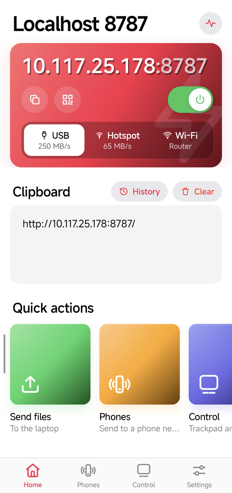
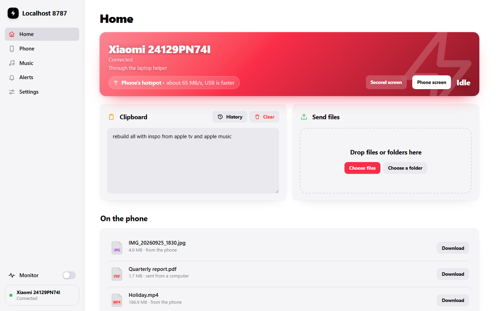

<p align="center">
  
</p>

<h1 align="center">Localhost 8787</h1>

<p align="center">
  Your Android phone becomes a small, private server. Your laptop opens it in a browser.<br>
  Clipboard, files, music, notifications and control move between them, and nothing leaves the room.
</p>

<p align="center">
  <a href="../../releases/latest"><b>Download the app</b></a>
</p>

<p align="center">
  
</p>

| Phone: Home | Phones | Control | Settings |
| --- | --- | --- | --- |
|  |  |  |  |

---

## ⚡ Speed

| How they are connected | Phone → laptop | Laptop → phone | Laptop keeps internet |
| :--- | ---: | ---: | :--- |
| **USB-C cable** (USB 3, USB tethering on) | **224–235 MB/s** | **257–271 MB/s** | Yes |
| **The phone's hotspot** | 59–68 MB/s | 64–65 MB/s | Yes, through the phone |
| **Direct link** (the phone's own private network) | 55–101 MB/s | 54–115 MB/s | No |
| Home Wi-Fi, through the router | 7.1–7.3 MB/s | 6.0–6.1 MB/s | Yes |

Measured between a Xiaomi 15 and a Wi-Fi 7 laptop (24–26 September 2026), with the data made
and thrown away on the spot so only the connection counts. A USB 2 cable (most charging cables)
tops out near 40 MB/s, and the app says so when that happens. The router here runs a narrow
20 MHz channel, which is why it is the slowest; see [Faster over the air](#faster-over-the-air).

---

## Features

### 1. Two looks: Theatre and Studio

Pick one in *Settings → Appearance*; the phone and every open laptop page switch together.

- **Theatre**: a dark night-blue banner at the top, the tabs as pills along the top edge,
  wide cards. Shown in all the pictures above.
- **Studio**: white or black, big bold titles, the tabs along the bottom on the phone and in a
  sidebar on the laptop.

**Colour**: Automatic (black and white, with the night-blue banner) or red, orange, yellow,
green, mint, blue or purple. The colour marks the tab you are on and the main buttons; nothing
else is tinted. **Light, dark or automatic** sits underneath. On the phone, **swipe left or
right** to move between tabs.

| Studio with red, phone | Studio with red, laptop |
| --- | --- |
|  |  |

### 2. Turn it on and connect a computer

Flip the switch at the top of Home. The phone shows its address in large type, for example
`10.117.25.178:8787`; tap it to copy, or show a QR code. Open that address on the laptop,
click **Ask to connect**, and tap **Allow** on the phone (both show the same 4-digit code).
No account, no password. The phone lists every computer and phone allowed in and can remove any.


### 3. Every way in, fastest first

Under the address, Home lists the ways a computer can reach the phone, with their speed:
**USB** (250 MB/s), **Hotspot** (65 MB/s) or **Direct** link, and **Wi-Fi** (through your
router). Tap one to show its address; tap one that is off to open the setting that turns it on.
The laptop page shows which one it is using as a badge (*USB cable · up to 250 MB/s*, or
*Wi-Fi · USB is faster*).

- **USB cable**: plug in and turn on USB tethering. Fastest by far.
- **Hotspot**: the phone's normal hotspot. The laptop stays online through the phone.
- **Direct link**: a private network the phone starts by itself (*Settings → Speed → Laptop
  link*: choose *Direct link*, then *Start*). No internet on it. Android allows only one hotspot at a time, so the app
  tells you when the normal hotspot is in the way.

### 4. One clipboard for both

Copy on one, paste on the other: text, pictures and files up to 50 MB. The box on Home shows
what is shared, **History** brings back the last 30 items, and **Clear** empties it everywhere.
With the laptop helper running it happens by itself both ways, including **every screenshot**
you take on the phone. To send copies from any phone app straight away, allow two things once
over USB:

```bash
adb shell pm grant dev.periy.bridge.debug android.permission.READ_LOGS
adb shell appops set dev.periy.bridge.debug SYSTEM_ALERT_WINDOW allow
```

### 5. Send files and whole folders

- **Laptop → phone**: drop files or folders on the page. Big files go over several connections
  at once and carry on where they stopped if the connection drops.
- **Phone → laptop**: share anything to Localhost 8787 from any app, or tap *Send files* on Home.
  It appears under *On the phone* on the page.
- Nothing can be deleted from the laptop. On the phone, *Clear* takes files off the list only.

### 6. Browse the phone from the laptop

The page's **Phone** tab shows the phone's folders (camera, downloads, documents...) with
thumbnails. Click a file to see it before downloading: photos (HEIC too), videos, music, PDFs,
text and Office files, full screen with arrows to step through. Download one file or a whole
folder as a zip. Read-only, and off until you allow it on the phone.


### 7. Your music, from the phone

The page's **Music** tab opens on your albums, largest first, each with its cover (albums
without one get one found online or drawn for them). Pick a genre to see and play only that
genre. Songs stream straight from the phone, so FLAC and everything else starts at once, and
skipping is instant. Media keys and the Windows media overlay work.

| Albums | An album |
| --- | --- |
|  |  |

### 8. Play in sync on several devices

The **Sync** button in the player lists the phone's speaker and every other computer with the
page open. Switch them on and they all play the same song at the same moment: pause, skip or
seek on any one and the rest follow. In tests the laptops stay within 0.1 ms of each other and
the phone within a few milliseconds.

### 9. The phone's notifications on the laptop

The page's **Alerts** tab shows all of the phone's notifications, each on its own card folded
to one line like Android's. Click to open it, reply to a message, or press its buttons (*Mark as
read*), and it happens on the phone. Ongoing ones (music, downloads) sit apart and never pop up.
Needs *Notification access* on the phone (*Settings → Notifications on the laptop*).


### 10. The phone as trackpad and keyboard

The phone's **Control** tab is a trackpad for the laptop, with Windows gestures (two fingers to
scroll, three for Task View, four to switch desktops), the phone's keyboard typing into the
laptop, and the laptop's volume and play/pause/next keys. It opens **locked**: tap once to use
it, so a swipe across it changes tab instead. It locks again when you leave.

### 11. The phone's screen on the laptop

*Phone screen* on the page opens the phone in a window on the laptop, to use with the mouse and
keyboard, sound included (via [scrcpy](https://github.com/Genymobile/scrcpy); the phone needs
USB debugging on). It uses the cable when one is plugged in.

### 12. The phone as a second screen

*Use as a second screen* on the Control tab shows the laptop's desktop on the phone; taps on it
click there. With a virtual-display driver on the laptop it is a real extra monitor. Protected
video (Netflix, Prime Video) shows black, as it does for any screen capture.

### 13. Laptop videos on the phone

A **Play on phone** bookmark sends the video playing on a page (YouTube and the like) to the
phone's picture-in-picture player. Get it from `http://localhost:8787/blazeit/video` with the
helper running.

### 14. Phone to phone

The **Phones** tab finds other phones running Localhost 8787 on the same Wi-Fi. Connect once
(same 4-digit code), then send files or text with a tap. With *Send over a direct link* on,
the two phones link to each other directly for the transfer.

### 15. A live monitor

The pulse button shows a small floating pill: speed each way, ping and signal, over any screen.
Tap it for the full picture: history, how full the connection is and with what, both ends of the
Wi-Fi link. On the laptop, *Monitor* docks it beside the page.

### 16. Measure the connection

*Settings → Measure* on the page tests the connection alone for five seconds each way. Compare
it with a real transfer: close means the network is the limit, far below means storage is.


### 17. The laptop helper

One file, **blazeit-pc.bat**, from the page's Settings. Double-click it; nothing is installed.
It finds the phone by itself, moves to the fastest connection (cable, hotspot, direct link or
Wi-Fi) and back when one goes, keeps the clipboard in step, runs the trackpad, the second screen
and the phone's screen, and serves the page at `http://localhost:8787` so downloads use every
connection. Starting it again replaces the running copy. Windows only for now.

---

## Getting started

1. Install the APK from [Releases](../../releases/latest) (Android 10 or later).
2. Open **Localhost 8787**, go to **Settings**, choose where received files go, and allow
   notifications (and music, if you want the Music tab).
3. Flip the switch on **Home** and open the address it shows on the laptop. Tap **Allow**.
4. For full speed and the extras, get **blazeit-pc.bat** from the page's **Settings** and run it.
5. For the most speed, plug in a USB-C cable and turn on USB tethering, or use the hotspot.

## Faster over the air

For hotspot mode, checked on 26 September 2026:

- The phone's hotspot already runs at its best here: 5 GHz, 80 MHz wide, Wi-Fi 6.
- **Try turning the phone's own Wi-Fi off** while the laptop is on its hotspot. The hotspot then
  has the radio and a channel to itself (the laptop's internet comes over mobile data instead).
- Keep the phone close to the laptop and not face down.
- On the laptop (Device Manager → Wi-Fi adapter → Advanced): turn *Leisure Power Save* off and
  set *Roaming Aggressiveness* to lowest.
- Set the home router to an **80 MHz** channel instead of 20 MHz for faster plain Wi-Fi (some
  Airtel routers lock this; their support can change it).
- 6 GHz Wi-Fi was opened in India in January 2026. Once the phone's software supports it there,
  the hotspot can move to a wider, emptier channel.
- Tried and not worth it: 160 MHz or Wi-Fi 7 on the phone's hotspot (switched off by the
  maker), two links at once, Wi-Fi Direct, and more parallel connections.

## Under the hood

- The phone runs a small web server (Ktor) in the background; the laptop page is one HTML file
  it serves. Live updates reach the page over a single event stream.
- Uploads use the resumable [tus](https://tus.io) protocol, split over parallel connections
  into one pre-allocated file. Downloads use byte ranges, so they resume too.
- Only computers and phones you allow get in: each gets a signed session you can revoke on the
  phone. Everything stays on the local network: no cloud, no account. Traffic is plain HTTP, so
  treat it like a file share on your own Wi-Fi.

## Building

JDK 17+ and the Android SDK (platform 36).

```bash
./gradlew :app:assembleDebug        # Windows: gradlew.bat :app:assembleDebug
adb install -r app/build/outputs/apk/debug/app-debug.apk
```

Kotlin and Jetpack Compose on the phone (Android 10+), Ktor 3 for the server; the page has no
build step and no dependencies. The code lives in `app/src/main/`: `assets/bridge.html` (the
page), `assets/blazeit-pc.bat` (the helper), and `java/dev/periy/bridge/` (`server/` for the
routes, uploads, music, sync and notifications, `ui/` for the app's screens and the two styles,
`net/` for addresses and the direct link).

## Known limits

- Over the air, 80 MHz Wi-Fi 6 is the most this phone's hotspot offers; for more, use a cable.
- On the direct link the laptop has no internet until the link stops.
- The helper, laptop control and the second screen are Windows only.
- Protected video cannot be shown on the second screen or sent with *Play on phone*.
- Apple Lossless (ALAC) does not play in browsers. Empty folders are not created.
