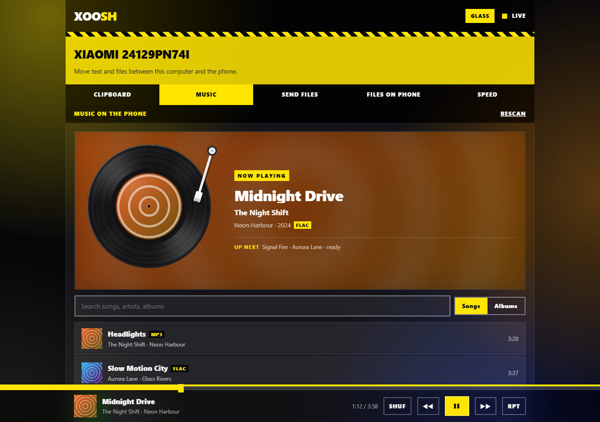
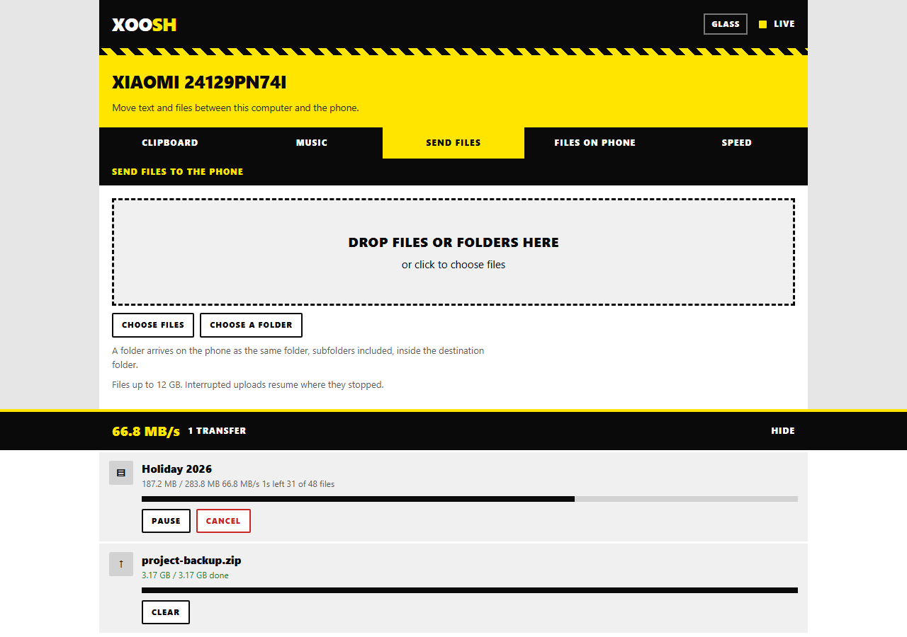
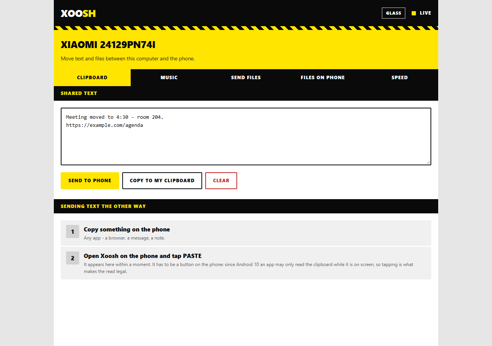
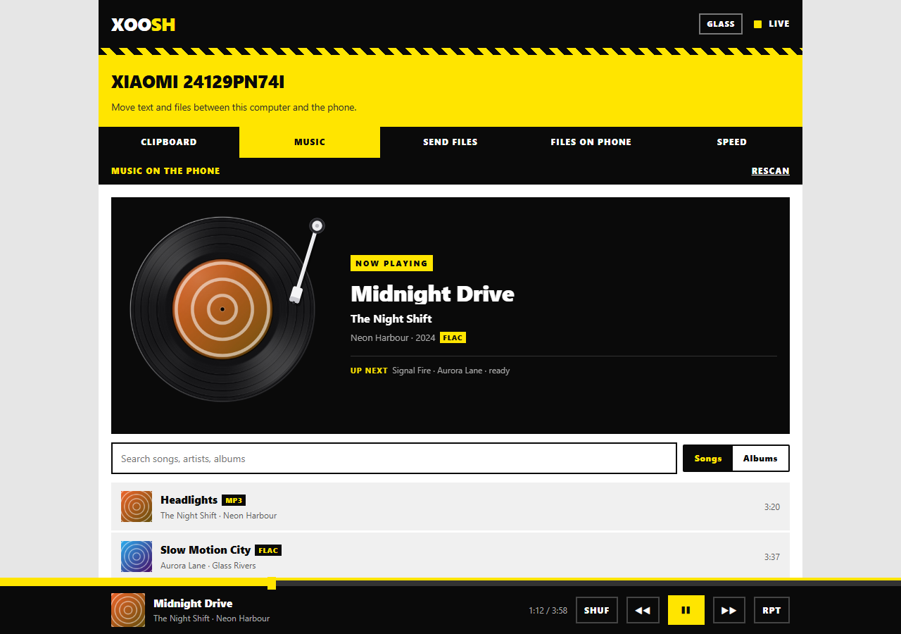
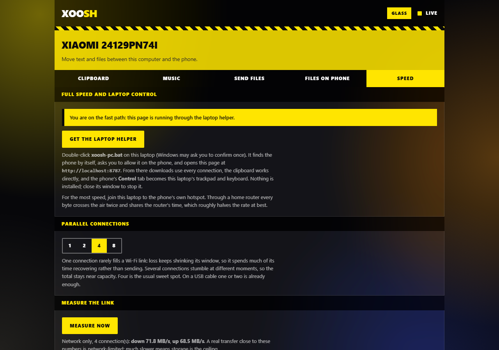

<p align="center">
  
</p>

<h1 align="center">Xoosh</h1>

<p align="center">
  Your Android phone becomes a small, private server. Your laptop opens it in a browser.<br>
  Clipboard, files, whole folders and your music library move between them, fast, and nothing ever leaves the room.
</p>

<p align="center">
  
</p>

---

## Contents

1. [What it does](#what-it-does)
2. [Features, one by one](#features-one-by-one)
3. [Getting started](#getting-started)
4. [Speed](#speed)
5. [How it works](#how-it-works)
6. [Security model](#security-model)
7. [Building](#building)
8. [Project layout](#project-layout)
9. [Known limits](#known-limits)
10. [Roadmap](#roadmap)

---

## What it does

The phone runs the server; the laptop needs nothing but a browser. There is no cloud,
no account and no relay: the two devices talk directly over Wi-Fi (or the phone's own
hotspot), so it works offline and is as fast as the radio allows.

| On the laptop (browser) | On the phone (app) |
| --- | --- |
|  |  |

---

## Features, one by one

### 1. Connect a computer (approve on the phone)

Open the address the phone shows. The browser asks to connect, the phone shows who is
asking with a 4-digit code, and you tap **Allow**. No PIN to type, no account. The phone
keeps a list of connected computers, shows which are live right now, and can remove any
of them.


### 2. Shared clipboard

Type or paste on either side and send it across. From the phone, **Paste** grabs what you
last copied. When the page runs through the laptop helper (see 8), copying to and from the
laptop's own clipboard works directly.



### 3. Send files and whole folders to the phone

Drop files **or folders** on the page, or use **Choose files** / **Choose a folder**.

- A folder arrives as the same folder, subfolders included, inside the destination folder you picked on the phone.
- Uploads are **resumable**: close the lid, walk out of range, come back; they continue where they stopped.
- Large files go up over **several parallel connections** into one pre-allocated file, and nothing is ever held whole in memory on either side (files up to 12 GB).
- A folder is one row with combined progress; its files go up a few at a time.


### 4. Send files from the phone to the laptop

Share anything to Xoosh from any app (gallery, file manager, WhatsApp...) or pick files in
the **Send** tab. They appear under **Files on phone** in the browser, ready to download.
Downloads use byte ranges, so they can resume and, through the laptop helper, run over
several connections at once.

### 5. Stream your music library

The **Music** tab lists every song on the phone, with search and an album view. Tracks
stream straight from the phone with range requests: playback starts after the first few
kilobytes, and seeking only fetches what you jump to. The next two tracks are loaded into
the laptop's memory while the current one plays, so skipping is instant. FLAC, MP3, AAC,
OGG, Opus and WAV all play. Media keys, the Windows media overlay, shuffle and repeat all
work.

The now-playing turntable uses the album cover as the record's label: the arm drops when
you press play, the disc spins, and pausing freezes it exactly where it is.

| Glass | Classic |
| --- | --- |
|  |  |

### 6. Two looks: Classic and Glass

A black-and-yellow, square-cornered design, in two materials. **Glass** puts frosted,
translucent panels over a glowing backdrop. It is one shared setting: flip it on the phone
or in the browser and every open page changes with it.

### 7. The phone as the laptop's trackpad and keyboard

The **Control** tab is one large trackpad with Windows gestures, plus the phone's own
keyboard typing straight into the laptop.

| Gesture | Does |
| --- | --- |
| One finger | Move the pointer. Tap to click, tap then drag (or hold) to drag |
| Two fingers | Scroll, with momentum after you lift. Pinch to zoom. Tap to right-click |
| Three fingers | Up: Task View. Down: show the desktop. Sideways: switch apps |
| Four fingers | Sideways: switch desktops |

**Keyboard**, **Ctrl**, **Win** and **Esc** sit in a row that moves up to sit right on
top of the phone's keyboard when it opens. Ctrl and Win apply to the next key or click,
so Ctrl then C copies. **Left** and **Right** are real mouse buttons you can hold. Pointer
speed is Slow, Normal or Fast.


This needs the laptop helper, below.

### 8. The laptop helper (one file, nothing installed)

A browser tab is not allowed to move the cursor, and a page on plain `http://` is not
allowed to use every connection for downloads or to touch the clipboard. The helper fixes
both. Download **xoosh-pc.bat** from the page's **Speed** tab and double-click it. It:

1. finds the phone on the network by itself, and again whenever the phone's address changes;
2. asks you once to allow it on the phone;
3. serves the Xoosh page at `http://localhost:8787`, which the browser treats as secure, so
   downloads run over every connection and the clipboard works directly;
4. turns the phone's **Control** tab into this laptop's trackpad and keyboard.

It is plain PowerShell and C# that Windows already has, so there is nothing to install and
no admin rights are needed. Close its window to stop it.



### 9. Measure the link

The **Speed** tab measures the network alone for five seconds each way, with the phone
generating and discarding the data so storage is out of the picture. Compare it with a
real transfer: close means the network is the ceiling, far below means storage is.

---

## Getting started

1. Install the app on the phone (Android 10 or later). See [Building](#building).
2. Open **Xoosh**, go to **Setup** and pick a **destination folder** for received files.
   Allow notifications, and allow music access if you want the Music tab.
3. Tap **Start**. The phone shows an address such as `http://192.168.1.11:8787/` and a QR code.
4. Open that address on the laptop and click **Ask to connect**. Tap **Allow** on the phone.
5. For full speed and laptop control, open the **Speed** tab, get **xoosh-pc.bat**, and run it.

**For the most speed, connect the laptop to the phone's hotspot.** Through a home router
every byte crosses the air twice and competes for the router's time; the phone's hotspot is
a direct link. The phone can share its hotspot while staying on Wi-Fi itself, and the
hotspot works with mobile data off, so Xoosh keeps working with no internet at all.

**Over USB:** `tools/xoosh-usb.bat` (or `.sh`) forwards the phone's port over a USB cable
with `adb` and opens `http://localhost:8787`.

---

## Speed

Measured between a Xiaomi 15 and a Wi-Fi 7 laptop, both on 5 GHz with a 1201 Mbps link.

| Path | Phone to laptop | Laptop to phone |
| --- | --- | --- |
| Through a home router | about 10 MB/s | about 15 MB/s |
| Phone hotspot, 1 connection | 60 MB/s | 44 MB/s |
| Phone hotspot, several connections | **72 MB/s** | **69 MB/s** |

Wi-Fi is the ceiling: a phone's two antennas on a 5 GHz channel top out around this, and
parallel connections are what get a real transfer close to it.

---

## How it works

```
 Phone (Android app)                                  Laptop
 ┌────────────────────────────────────────┐          ┌─────────────────────────────┐
 │ Foreground service                     │          │ Browser: the Xoosh page     │
 │  └ Ktor server on :8787                │  Wi-Fi   │  served by the phone        │
 │     ├ page, pairing, SSE events        │◄────────►│                             │
 │     ├ tus uploads (parallel windows)   │  or USB  │ xoosh-pc.bat (optional)     │
 │     ├ range downloads, music streams   │          │  ├ finds the phone (UDP)    │
 │     └ control stream for the trackpad  │          │  ├ localhost relay :8787    │
 │ Storage: SAF folder, MediaStore        │          │  └ SendInput for the pointer│
 │ UI: Jetpack Compose                    │          │     and keyboard            │
 └────────────────────────────────────────┘          └─────────────────────────────┘
```

- **Server.** Ktor 3 (CIO) inside a foreground service, so it survives the screen turning off.
- **Uploads.** The [tus 1.0](https://tus.io) resumable protocol, plus a small extension that
  splits one file into windows and fills them over parallel connections. The file is
  pre-allocated, and bytes stream from the socket to disk.
- **Storage.** Files go into the folder you choose through Android's Storage Access
  Framework, written in place where the folder allows it. Photos and videos are added to
  the gallery.
- **Live updates.** Server-Sent Events push file lists, clipboard changes and the theme to
  every open page.
- **Music.** Read from Android's media index (audio permission only); covers come from the
  index's thumbnails.
- **Laptop control.** The trackpad screen turns gestures into short text lines on one
  long-lived HTTP response; the helper replays them with Windows `SendInput`.

---

## Security model

- Nothing leaves the local network: no cloud, no relay, no account.
- A computer gets in only after you allow it on the phone. Its session is an HMAC-signed
  cookie tied to an entry in the phone's device list; removing the entry locks it out at
  once, and **Unpair all** also rotates the signing key.
- Every route requires a paired session by default; the few public ones (the page itself,
  pairing, a ping) are listed in one place.
- Pairing requests are rate-limited and expire after two minutes.
- Traffic is plain HTTP on the local network. Treat it like a file share on your own Wi-Fi.

---

## Building

Requirements: JDK 17 or newer and the Android SDK with platform 36.

```bash
./gradlew :app:assembleDebug        # Windows: gradlew.bat :app:assembleDebug
adb install -r app/build/outputs/apk/debug/app-debug.apk
```

Or open the project in Android Studio and press Run.

| | |
| --- | --- |
| Language | Kotlin 2.1, Jetpack Compose |
| Server | Ktor 3.1 (CIO) |
| Android | minSdk 29 (Android 10), targetSdk 36 |
| Browser page | One HTML file, no build step, no dependencies |

---

## Project layout

```
app/src/main/
  assets/
    bridge.html            the page the laptop opens (HTML, CSS, JS in one file)
    xoosh-pc.bat           the laptop helper, served by the page
    vinyl/                 record and light-sheen images for the turntable
  java/dev/periy/bridge/
    BridgeApp.kt           app-wide objects
    server/
      BridgeServer.kt      routes, auth gate, SSE, downloads, music, control stream
      TusStore.kt          resumable, parallel uploads
      Storage.kt           destination folder, direct writes, folders, gallery
      Pairing.kt  Auth.kt  approve-on-phone pairing, sessions, device list
      Music.kt             music library, covers, range streaming
      Control.kt           trackpad event stream, discovery beacon
      Transfers.kt  Events.kt  FileIndex.kt  Model.kt  SystemClipboard.kt
    service/BridgeService.kt   foreground service, notification, locks
    ui/                    Compose screens: Home, Send, Control, Setup, theme
    net/NetInfo.kt         which addresses the phone can be reached on
tools/                     USB shortcuts
docs/images/               screenshots
```

---

## Known limits

- Laptop control and the helper are Windows only for now.
- Windows ignores simulated input in administrator windows (Task Manager, installers)
  unless the helper itself runs as administrator.
- Apple Lossless (ALAC) does not play in browsers; other formats do. There is a short gap
  between tracks.
- Empty folders are not created. Leading dots are dropped from names, so `.git` arrives as `git`.
- A folder upload resumes within the same page; after a reload, send the folder again.
- Phones on mobile data are behind carrier NAT and cannot be reached from outside; use the
  phone's hotspot or USB instead.

---

## Roadmap

- Phone to phone: two phones find each other on the same network, or pair directly over Wi-Fi Direct.
- Laptop helper for macOS and Linux.
- A `xoosh.local` name so the address never changes.
- Two-way folder sync.

Ideas and issues are welcome.
