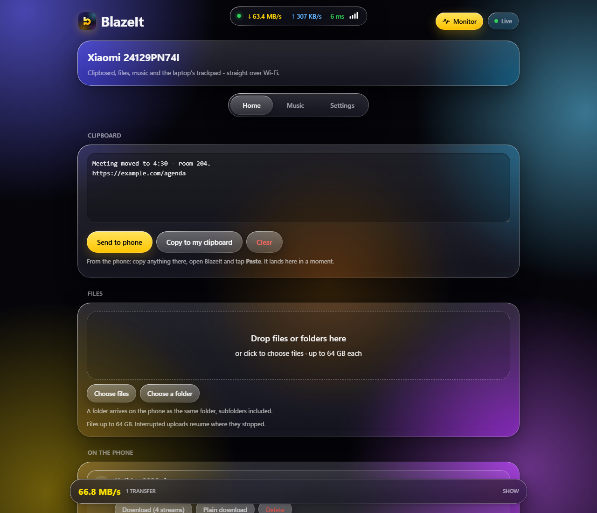
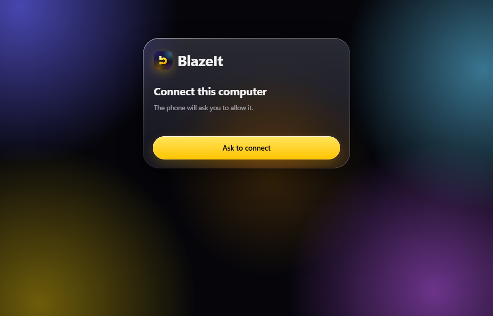
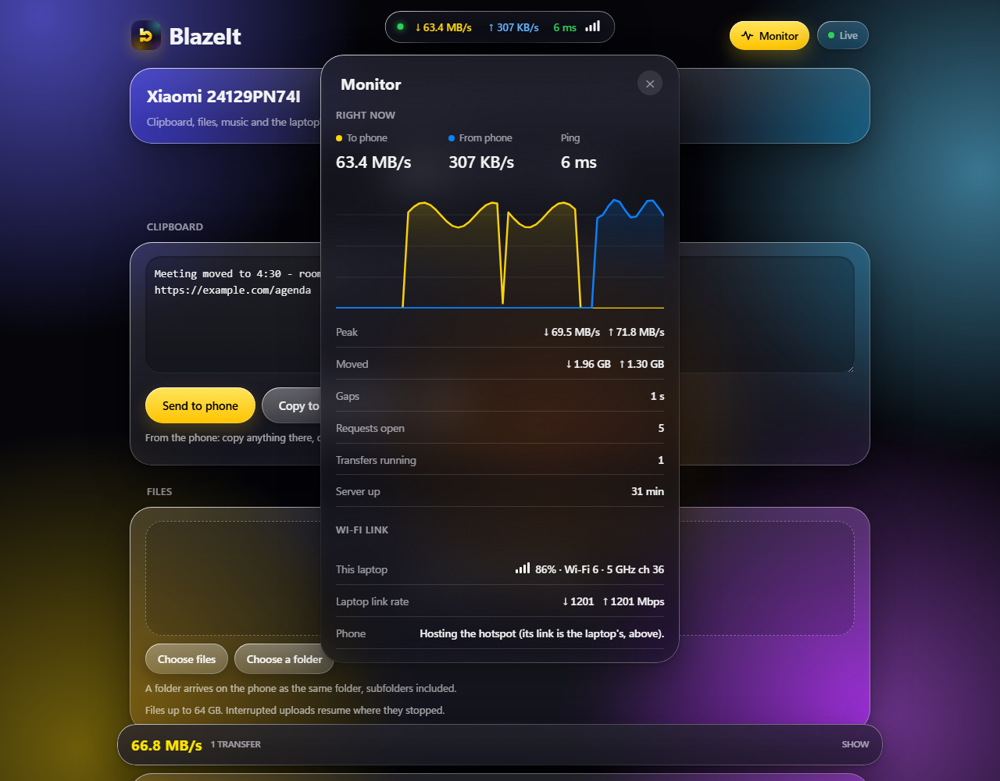
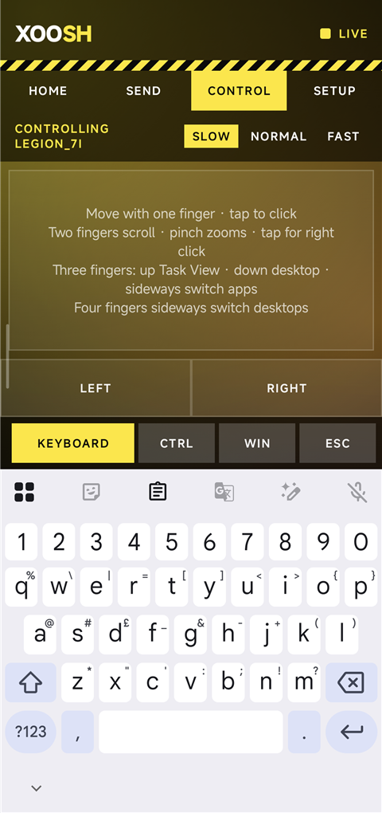
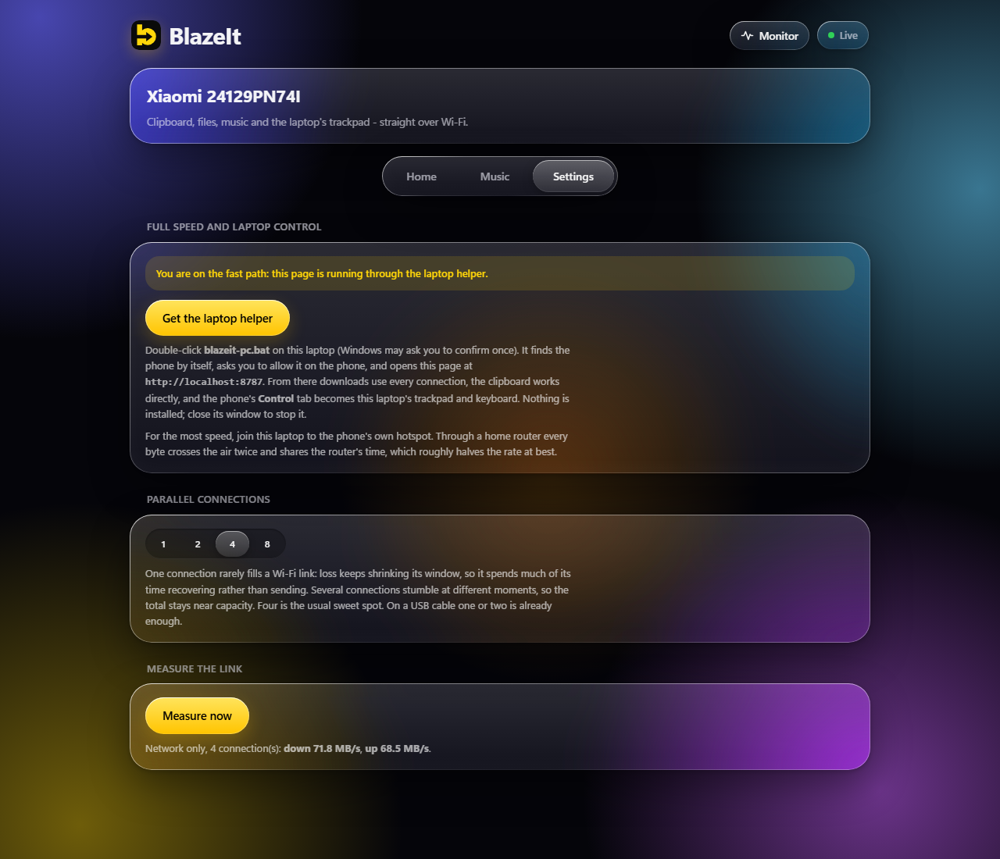
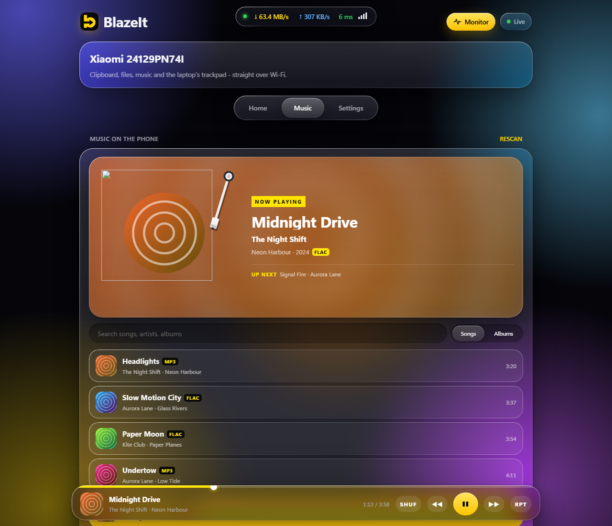

<p align="center">
  
</p>

<h1 align="center">BlazeIt</h1>

<p align="center">
  Your Android phone becomes a small, private server. Your laptop opens it in a browser.<br>
  Clipboard, files and whole folders move between them at full Wi-Fi speed, and nothing ever leaves the room.
</p>

<p align="center">
  <a href="../../releases/latest"><b>Download the app</b></a>
</p>

## ⚡ Speed

| | Phone → laptop | Laptop → phone |
| :--- | ---: | ---: |
| **BlazeIt, over the phone's Wi-Fi 6 hotspot** | **67–72 MB/s** | **64–69 MB/s** |
| Through a typical home router | ~10 MB/s | ~15 MB/s |

Measured with real 2 GB files between a Xiaomi 15 and a Wi-Fi 7 laptop on 5 GHz, 80 MHz
(a 1201 Mbps link). That is within a few percent of what the radio link itself carries.
No cloud upload, no relay: the laptop talks to the phone directly, uploads and downloads
run over **several connections at once**, and files stream straight to disk in large
blocks without ever being held in memory. A 4 GB video crosses in about a minute. Files of
**up to 64 GB** are accepted (Setup → *Largest file accepted*).

<p align="center">
  
</p>

---

## Contents

1. [Features, one by one](#features-one-by-one)
2. [Getting started](#getting-started)
3. [How it works](#how-it-works)
4. [Security model](#security-model)
5. [Building](#building)
6. [Project layout](#project-layout)
7. [Known limits](#known-limits)
8. [Roadmap](#roadmap)

---

## Features, one by one

### 1. Liquid Glass, on both sides

The app and the page share one look: sheets of glass over a softly lit backdrop, a rim
that catches the light, capsule buttons, and the brand yellow as the only accent. On the
phone the tab bar and the monitor are real blurred glass floating over the content.

### 2. Connect a computer (approve on the phone)

Open the address the phone shows. The browser asks to connect, the phone shows who is
asking with a 4-digit code, and you tap **Allow**. No PIN to type, no account. The phone
keeps a list of connected computers and phones, shows which are live right now, and can
remove any of them.



### 3. Clipboard and files, together on Home

Everything you move lives on one screen, on both sides.

- **Clipboard.** Type or paste on either side and send it across. On the phone, **Paste**
  grabs what you last copied. Through the laptop helper (see 7) the page reads and writes
  the laptop's own clipboard directly.
- **Files to the phone.** Drop files **or whole folders** on the page, or use *Choose
  files* / *Choose a folder*. A folder arrives as the same folder, subfolders included.
  Uploads are **resumable** and large files go up over **parallel connections** into one
  pre-allocated file.
- **Files to the laptop.** Share anything to BlazeIt from any app, or tap *Send files to
  the computer* on Home. They show up under *On the phone* in the browser. Downloads use
  byte ranges, so they resume and, through the helper, run over several connections.

### 4. A live monitor over every screen

Tap the pulse button (phone) or **Monitor** (page) and a small glass capsule floats over
whatever you are doing: speed each way, **ping**, and signal strength. Drag it out of the
way on the phone. Tap it for the full picture:

- a minute of history for both directions;
- peak speed, total moved, open requests and running transfers;
- **gaps**: seconds where a transfer was running but nothing moved;
- both ends of the Wi-Fi link: the phone's own (standard, band, dBm, link rate) and the
  laptop's as the helper reports it (signal, channel, radio, link rate).

Ping is measured by the page and the helper and shared with the phone, so both monitors
show it.



### 5. Phone to phone

The **Phones** tab lists other phones running BlazeIt on the same Wi-Fi (or on one
phone's hotspot), found automatically. Tap **Connect**, allow it on the other phone
with the same 4-digit code, and from then on send files or the clipboard text with one
tap. Files go over the same parallel, resumable upload the browser uses. If a router
blocks discovery, *Connect by address* takes the other phone's IP.

Both phones share one Wi-Fi channel, so two phones do not add up to double the speed:
the radio time is split, not stacked. Expect the same ~65–70 MB/s per link.

### 6. The phone as the laptop's trackpad and keyboard

The **Control** tab is one large trackpad with Windows gestures, plus the phone's own
keyboard typing straight into the laptop.

| Gesture | Does |
| --- | --- |
| One finger | Move the pointer. Tap to click, tap then drag (or hold) to drag |
| Two fingers | Scroll, with momentum after you lift. Pinch to zoom. Tap to right-click |
| Three fingers | Up: Task View. Down: show the desktop. Sideways: switch apps |
| Four fingers | Sideways: switch desktops |

**Keyboard**, **Ctrl**, **Win** and **Esc** sit in a row that rides on top of the phone's
keyboard when it opens. Ctrl and Win apply to the next key or click, so Ctrl then C
copies. **Left** and **Right** are real mouse buttons you can hold. The speed chip in the
pad's corner cycles Slow, Normal and Fast.



### 7. The laptop helper (one file, nothing installed)

A browser tab may not move the cursor, and a page on plain `http://` may not use every
connection for downloads or touch the clipboard. The helper fixes both. Get
**blazeit-pc.bat** from the page's **Settings** tab and double-click it. It:

1. finds the phone on the network by itself, and again whenever the phone's address changes;
2. asks you once to allow it on the phone;
3. serves the page at `http://localhost:8787`, which the browser treats as secure, so
   downloads run over every connection and the clipboard works directly;
4. turns the phone's **Control** tab into this laptop's trackpad and keyboard;
5. reports the laptop's Wi-Fi link and ping to the monitor.

It is plain PowerShell and C# that Windows already has, so there is nothing to install and
no admin rights are needed. Close its window to stop it.



### 8. Measure the link

**Settings → Measure now** tests the network alone for five seconds each way, with the
phone generating and discarding the data so storage is out of the picture. Compare it
with a real transfer: close means the network is the ceiling, far below means storage is.

### 9. Stream your music library

The **Music** tab lists every song on the phone, with search and an album view. Tracks
stream straight from the phone with range requests: playback starts after the first few
kilobytes, and seeking only fetches what you jump to. The next two tracks load while the
current one plays, so skipping is instant. FLAC, MP3, AAC, OGG, Opus and WAV all play.
Media keys, the Windows media overlay, shuffle and repeat all work.

The now-playing turntable uses the album cover as the record's label: the arm drops when
you press play, the disc spins, and pausing freezes it exactly where it is. The player
floats at the bottom as its own piece of glass.



---

## Getting started

1. Download the APK from [Releases](../../releases/latest) and install it on the phone
   (Android 10 or later; allow installing from your browser or file manager when asked).
2. Open **BlazeIt**, go to **Setup** and pick a **destination folder** for received files.
   Allow notifications, and allow music access if you want the Music tab.
3. Flip the switch on **Home**. The phone shows an address such as `http://192.168.1.11:8787`.
4. Open that address on the laptop and click **Ask to connect**. Tap **Allow** on the phone.
5. For full speed, laptop control and the laptop side of the monitor, open **Settings**
   on the page, get **blazeit-pc.bat**, and run it.

**For the most speed, connect the laptop to the phone's hotspot.** Through a home router
every byte crosses the air twice and competes for the router's time; the phone's hotspot
is a direct link. It works with mobile data off, so BlazeIt keeps working with no internet
at all.

**Over USB:** `tools/blazeit-usb.bat` (or `.sh`) forwards the phone's port over a cable
with `adb` and opens `http://localhost:8787`.

---

## How it works

```
 Phone (Android app)                                  Laptop
 ┌────────────────────────────────────────┐          ┌─────────────────────────────┐
 │ Foreground service                     │          │ Browser: the BlazeIt page   │
 │  └ Ktor server on :8787                │  Wi-Fi   │  served by the phone        │
 │     ├ page, pairing, SSE events        │◄────────►│                             │
 │     ├ tus uploads (parallel windows)   │  or USB  │ blazeit-pc.bat (optional)   │
 │     ├ range downloads, music streams   │          │  ├ finds the phone (UDP)    │
 │     ├ monitor: rates, gaps, link, ping │          │  ├ localhost relay :8787    │
 │     └ control stream for the trackpad  │          │  ├ SendInput for pointer    │
 │ NSD: finds other phones running it     │          │  │  and keyboard            │
 │ Storage: SAF folder, MediaStore        │          │  └ Wi-Fi link + ping report │
 │ UI: Jetpack Compose + Haze blur        │          │                             │
 └────────────────────────────────────────┘          └─────────────────────────────┘
```

- **Server.** Ktor 3 (CIO) inside a foreground service, so it survives the screen turning off.
- **Uploads.** The [tus 1.0](https://tus.io) resumable protocol, plus a small extension that
  splits one file into windows and fills them over parallel connections. The file is
  pre-allocated, and bytes stream from the socket to disk in 512 KB blocks.
- **Storage.** Files go into the folder you choose through Android's Storage Access
  Framework, written in place where the folder allows it. Photos and videos are added to
  the gallery.
- **Live updates.** Server-Sent Events push file lists and clipboard changes to every open page.
- **Monitor.** Byte counters on every transfer path, sampled once a second over the real
  elapsed time; the phone's link comes from `WifiManager`, the laptop's from the helper.
- **Phone to phone.** Each phone advertises `_blazeit._tcp` over NSD; pairing and uploads
  reuse the same endpoints a browser uses.
- **Music.** Read from Android's media index (audio permission only).
- **Laptop control.** The trackpad turns gestures into short text lines on one long-lived
  HTTP response; the helper replays them with Windows `SendInput`.

---

## Security model

- Nothing leaves the local network: no cloud, no relay, no account.
- A computer or phone gets in only after you allow it on the phone. Its session is an
  HMAC-signed cookie tied to an entry in the phone's device list; removing the entry locks
  it out at once, and **Unpair everything** also rotates the signing key.
- Every route requires a paired session by default; the few public ones (the page itself,
  pairing, a ping) are listed in one place.
- Pairing requests are rate-limited and expire after two minutes.
- Traffic is plain HTTP on the local network. Treat it like a file share on your own Wi-Fi.

---

## Building

Requirements: JDK 17 or newer and the Android SDK with platform 36.

```bash
./gradlew :app:assembleDebug        # Windows: gradlew.bat :app:assembleDebug
adb install -r app/build/outputs/apk/debug/app-debug.apk
```

| | |
| --- | --- |
| Language | Kotlin 2.1, Jetpack Compose |
| Server | Ktor 3.1 (CIO) |
| Blur | [Haze](https://github.com/chrisbanes/haze) |
| Android | minSdk 29 (Android 10), targetSdk 36 |
| Browser page | One HTML file, no build step, no dependencies |

---

## Project layout

```
app/src/main/
  assets/
    bridge.html            the page the laptop opens (HTML, CSS, JS in one file)
    blazeit-pc.bat         the laptop helper, served by the page
    vinyl/                 record and light-sheen images for the turntable
  java/dev/periy/bridge/
    BridgeApp.kt           app-wide objects
    server/
      BridgeServer.kt      routes, auth gate, SSE, downloads, music, monitor, control
      TusStore.kt          resumable, parallel uploads
      Storage.kt           destination folder, direct writes, folders, gallery
      Monitor.kt           live rates, gaps, Wi-Fi link, ping
      Peers.kt             finding, pairing with and sending to other phones
      Pairing.kt  Auth.kt  approve-on-phone pairing, sessions, device list
      Music.kt             music library, covers, range streaming
      Control.kt           trackpad event stream, discovery beacon
    service/BridgeService.kt   foreground service, notification, locks
    ui/                    Compose: Home, Phones, Control, Setup, monitor overlay, theme
    net/NetInfo.kt         which addresses the phone can be reached on
tools/                     USB shortcuts
docs/images/               icon and screenshots
```

---

## Known limits

- Wi-Fi 6 on 5 GHz is the ceiling on this pair: the phone's hotspot does not offer Wi-Fi 7
  or 6 GHz where the SIM's country disables it, and both radios are 2×2. A Wi-Fi 7 router
  with 160 MHz channels and a wired laptop is the way past ~70 MB/s.
- Laptop control and the helper are Windows only for now.
- Windows ignores simulated input in administrator windows unless the helper itself runs
  as administrator.
- Apple Lossless (ALAC) does not play in browsers; other formats do.
- Empty folders are not created. Leading dots are dropped from names, so `.git` arrives as `git`.
- A folder upload resumes within the same page; after a reload, send the folder again.

---

## Roadmap

- Monitor as a system-wide floating bubble over other apps.
- Laptop helper for macOS and Linux.
- A `blazeit.local` name so the address never changes.
- Two-way folder sync.

Ideas and issues are welcome.
