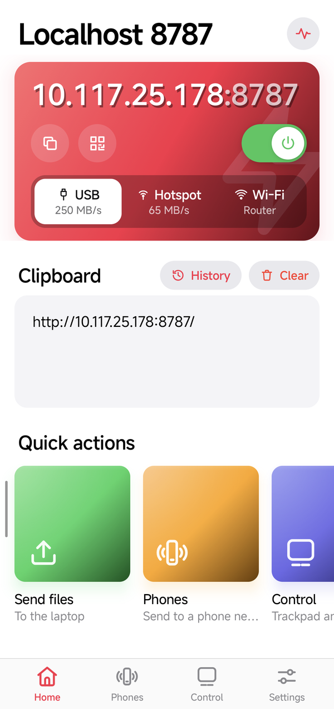
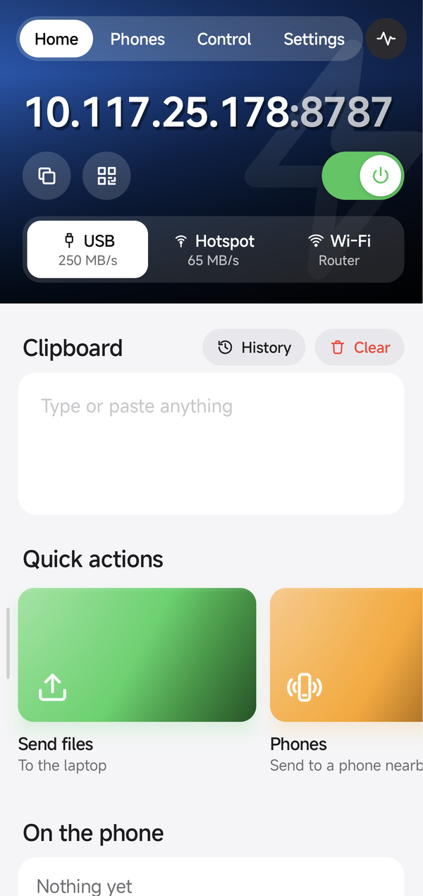
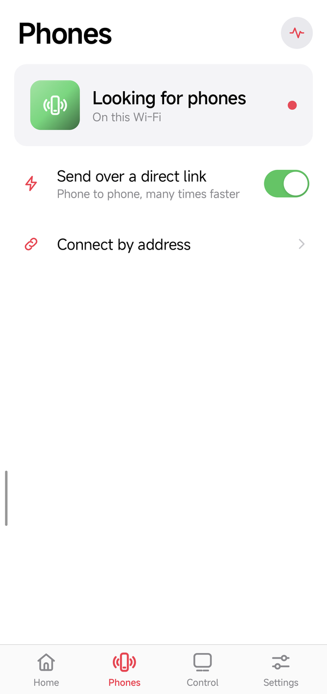
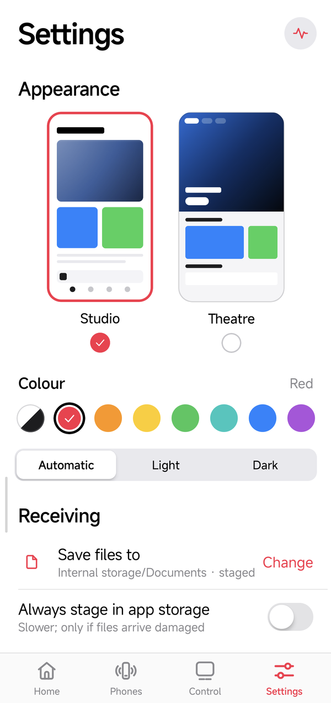
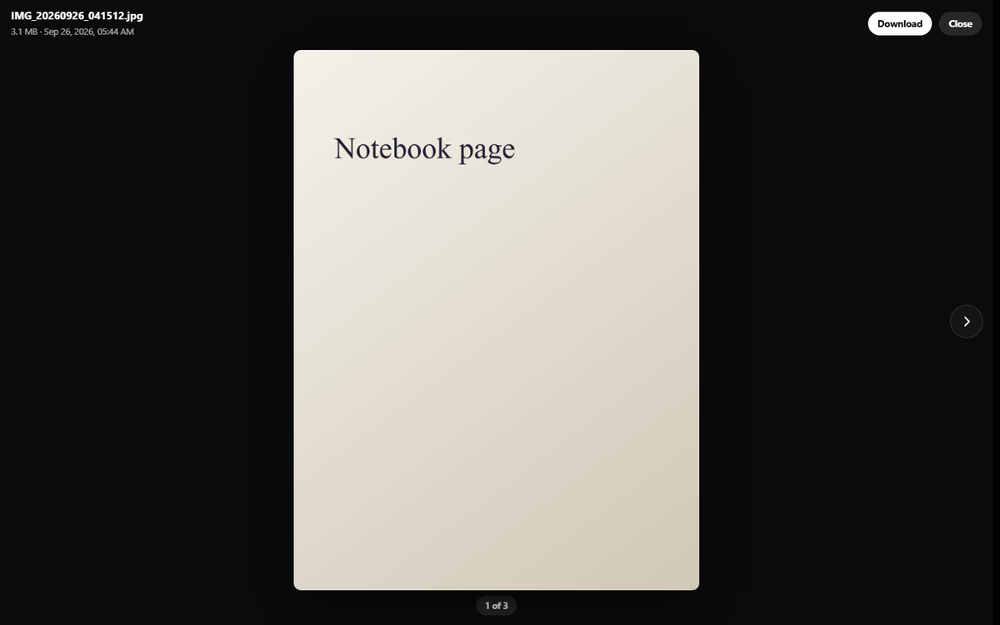
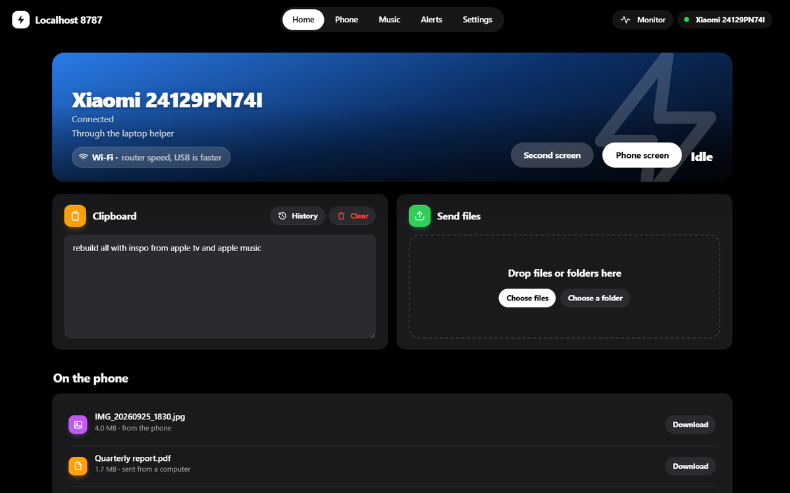
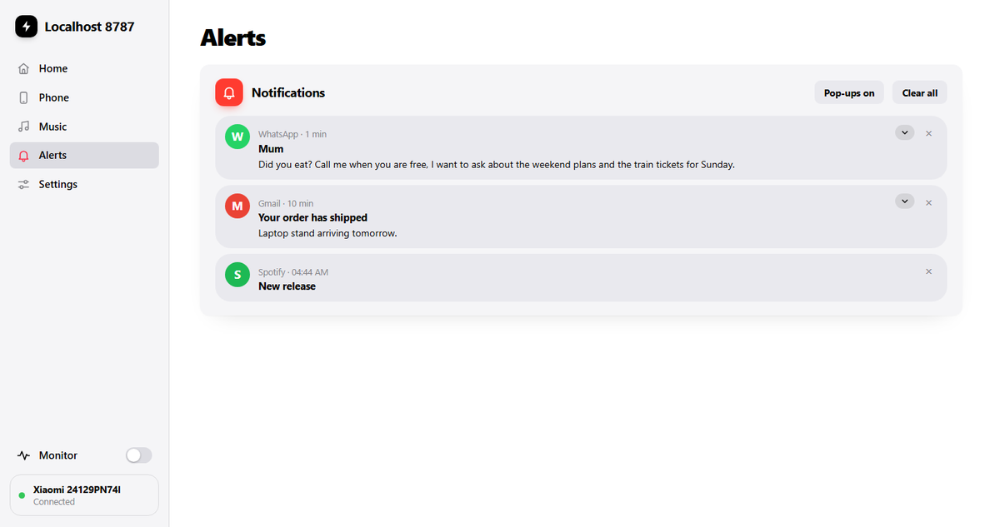
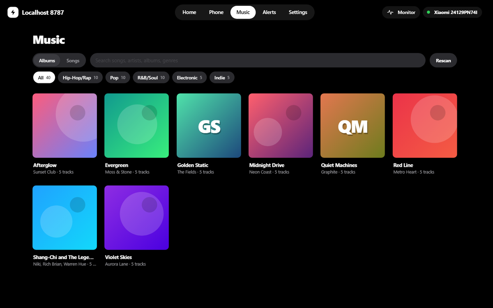
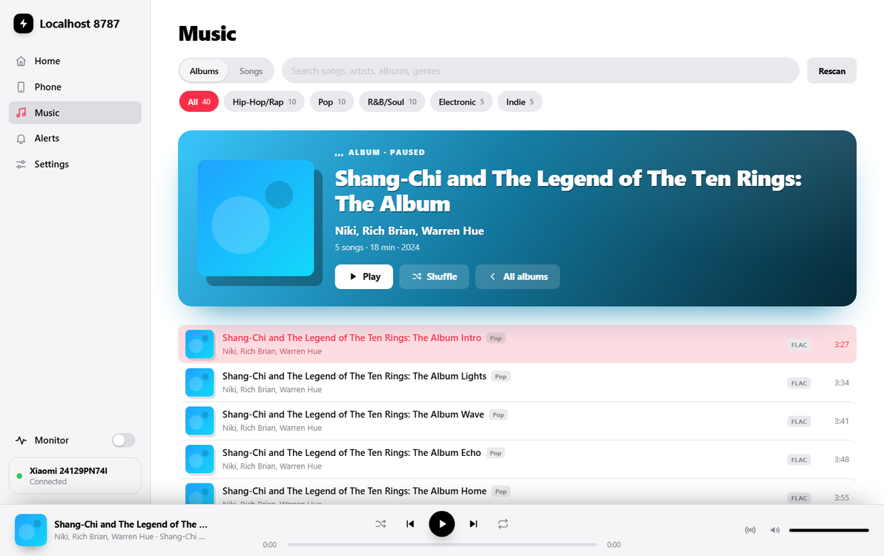

<p align="center">
  
</p>

<h1 align="center">Localhost 8787</h1>

<p align="center">
  Your Android phone becomes a small, private server. Your laptop opens it in a browser.<br>
  Clipboard, files and whole folders move between them at full Wi-Fi speed, and nothing ever leaves the room.
</p>

<p align="center">
  <a href="../../releases/latest"><b>Download the app</b></a>
</p>

## ⚡ Speed

| | Phone → laptop | Laptop → phone | Laptop internet |
| :--- | ---: | ---: | :--- |
| **USB-C cable (USB 3), USB tethering** | **224–235 MB/s** | **257–271 MB/s** | Yes |
| Localhost 8787 direct link (the phone's own offline network) | 55–101 MB/s | 54–115 MB/s | No |
| The phone's hotspot (hotspot mode) | 59–68 MB/s | 64–65 MB/s | Yes, through the phone |
| Through the home router the two were sharing (a 20 MHz channel) | 2.5 MB/s | 3.3 MB/s | Yes |

Measured on 24–25 September 2026 between a Xiaomi 15 (Android 16) and a Realtek Wi-Fi 7 laptop,
with the phone generating and discarding the data so only the link counts; the cable's upper
figures are a real 2 GB file through the app, storage included. A USB 2 cable (most charging
cables) holds the same port to about 40 MB/s; the helper and the page's Home card say when
the cable has come up at USB 2, and the phone offers to turn on USB tethering when a computer
is on the cable without it. Wi-Fi ran on 5 GHz, 80 MHz, Wi-Fi 6 (a 1201 Mbps
link), which is as far as a phone-hosted network goes here; the spread between runs is the air.

**A USB 3 cable is the fastest way by far**, and with the phone's Wi-Fi off the laptop gets the
phone's mobile data over the same cable while files move at full speed.

**The direct link** is a Wi-Fi network the phone hosts for itself: choose it in *Settings →
Speed → Laptop link* and tap *Start*, and the phone starts it, with no trip to Android's
settings and no internet shared. The laptop helper sees it, moves the laptop onto it, and
moves it back to your Wi-Fi when you stop. One hop, no router taking turns, nobody else on the
channel. Files of any size, resumable, over several connections at once, straight to disk.

Home on the phone shows every way in at once, fastest first (*USB 250 MB/s · Hotspot 65 MB/s ·
Wi-Fi*), with the address of the one picked in large type; one that is not up opens the setting
that brings it up. With the helper running the laptop moves to the fastest by itself, and the
page's Home says which it is on (*USB cable · up to 250 MB/s*, or *Wi-Fi · USB is faster*).

### Faster over the air (hotspot mode)

Checked on 26 September 2026 on this pair, with the phone's hotspot running:

- **Where it stands.** The phone's hotspot runs on 5 GHz, channel 36, **80 MHz, Wi-Fi 6**,
  two streams: a 1201 Mbps link. 59–68 MB/s through it is about half of that, which is normal
  for a phone as the access point. The laptop's TCP (auto-tuning, CUBIC, RSS) needs nothing.
- **The phone's own Wi-Fi shares the hotspot's radio.** With the phone on the home router, the
  hotspot has to sit on the router's channel and take turns with that link, and the laptop's
  internet crosses the same channel twice. Turning the phone's Wi-Fi off (the laptop then gets
  the phone's mobile data) lets the hotspot pick its own channel and keep the air to itself;
  measure before and after with *Settings → Measure*.
- **Distance.** Within a metre or two, not face down or under the laptop's lid; the
  monitor shows the signal on both ends.
- **On the laptop** (Device Manager → the Wi-Fi adapter → Advanced): *Leisure Power Save*
  off and *Roaming Aggressiveness* lowest, so the adapter neither dozes nor scans mid-transfer.
- **The home router** here runs a **20 MHz** channel: both devices link to it at only
  286 Mbps. Set it to 80 MHz for Wi-Fi mode (Airtel locks this on some routers; their support
  can change it).
- **6 GHz is coming.** India opened 5925–6425 MHz to Wi-Fi on 20 January 2026 and the laptop
  can use it, but the phone's firmware still offers no 6 GHz channels for India. When an
  update adds them, a 6 GHz hotspot on a clean, wider channel is the next step up.
- **Not worth it:** a second link the other way (61 → 65 MB/s), 160 MHz on 5 GHz (Android
  discards the request), Wi-Fi 7 hosting (off in the vendor's configuration), Wi-Fi Direct
  (35–42 MB/s), and more connections (eight already fill the link).

<p align="center">
  
</p>

---

## Contents

1. [Features, one by one](#features-one-by-one)
2. [Getting started](#getting-started)
3. [How it works](#how-it-works)
4. [Security model](#security-model)
5. [Building](#building)
6. [Project layout](#project-layout)
7. [Known limits](#known-limits)
8. [Roadmap](#roadmap)

---

## Features, one by one

### 1. Two styles, on both sides

The app and the page share one style, picked in *Settings → Appearance* on the phone or on
the page; the phone and every open page follow at once.

- **Studio** (the default), after Apple Music. White or black, heavy large titles, the tabs
  along the bottom. Home opens on a card: the address in large type with a hard shadow (a
  tap copies it), copy and QR code under it, the on/off switch beside them, and the ways in,
  fastest first. Then the clipboard and a shelf of square artwork for sending files, phones and
  control. On the page, a sidebar.
- **Theatre**, after the Apple TV app. The tabs are pills along the top, see-through over the
  dark hero and solid once the page scrolls past it. Home opens on that hero, under the status
  bar on the phone, laid out the same way, then the clipboard and a shelf of wide cards.

On the phone, **swipe sideways** to move between Home, Phones, Control and Settings: the page
slides with a little depth, and the tab's highlight follows your finger.

**Colour.** Under the styles, one row: **Automatic**, each style's own palette, or red
(Apple Music's pink-red), orange, yellow, green, mint, blue
or purple. The colour marks the tab you are on, the main buttons and the card at the top;
everything else keeps its own colours, with no coloured glow. **Automatic, light or dark** sits
under that. All three are shared between the phone and every open page.

| Home | Home, Theatre | Phones | Control | Settings |
| --- | --- | --- | --- | --- |
|  |  |  |  |  |

### 2. Connect a computer (approve on the phone)

Open the address the phone shows. The browser asks to connect, the phone shows who is
asking with a 4-digit code, and you tap **Allow**. No PIN to type, no account. The phone
keeps a list of connected computers and phones, shows which are live right now, and can
remove any of them.


### 3. Clipboard and files, together on Home

Everything you move lives on one screen, on both sides.

- **Clipboard.** One clipboard for both, with no Send, Paste or Copy buttons: whatever is
  copied on one side is on the other's clipboard already. Type in it, or paste anything (text,
  a screenshot, a photo, any file up to 50 MB). A picture shows as a preview, a file as a card
  with *Download*; **Clear** empties it everywhere. The clock opens the **history**: the last
  30 items, like a keyboard's or Windows' clipboard; click one to put it back, or remove it.
- **Files to the phone.** Drop files **or whole folders** on the page, or use *Choose
  files* / *Choose a folder*. A folder arrives as the same folder, subfolders included.
  Uploads are **resumable** and large files go up over **parallel connections** into one
  pre-allocated file.
- **Files to the laptop.** Share anything to Localhost 8787 from any app, or tap *Send files to
  the computer* on Home. They show up under *On the phone* in the browser. Downloads use
  byte ranges, so they resume and, through the helper, run over several connections.
- **Nothing shared can be deleted**, from the page or the app: a shared file goes only when
  it is deleted on the phone itself, and the list drops it then. On the phone, *Clear* (or the
  × on a file) under *On the phone* takes files off the list, never off the phone.

### 4. Browse the phone from the laptop

The page's **Phone** tab shows the phone's own folders (DCIM, Download, Documents and the
rest) with thumbnails for photos and videos. Click a file to **preview it before
downloading**: photos (HEIC and DNG converted on the phone), videos and music (with seeking),
PDFs, text files, and the text of Word, PowerPoint, Excel and OpenDocument files; arrow keys
step through the folder. Files too big to look at this way (a film over 500 MB, say) offer the
download instead, with *Preview anyway* one click away. Download any file (in parallel ranges, resumable) or a whole folder
as one zip. Read-only: nothing on the phone can be changed or deleted from
the laptop. It stays off until you allow it on the phone (*Settings → Laptop access → Browse
this phone*, which opens Android's "All files access" screen). Over a USB 3 cable a 196 MB
video came across at 217 MB/s on one connection.

The preview is full screen on black, like Photos: the picture centred, round arrows over its
sides (gone at either end), and where you are in the folder at the foot.



### 5. Clipboard that follows you

With the laptop helper running, whatever you copy on the laptop is ready to paste on the
phone, and whatever you copy on the phone lands in the laptop's clipboard as soon as you open
Localhost 8787 or tap its **Send clipboard** quick-settings tile (Android lets an app read the
clipboard only while it is on screen). Both directions took about half a second in testing.
Text, pictures and files: a screenshot copied on Windows is ready to paste on the phone, and a
photo copied on the phone pastes into apps on the laptop, or into a folder as a file. It works
with Localhost 8787 closed, since the server runs in the background: what the laptop copies lands on
the phone's clipboard, **every screenshot you take goes over by itself** (the way a keyboard
spots new screenshots), and selected text goes over at once with **Send to laptop** in the
selection menu of any app. Android lets only the keyboard and the app on screen read copied
text; Localhost 8787 gets round that the way KDE Connect does (the system log says when a copy is
made, and a blink-long invisible window reads it), so **whatever you copy in any app is on the
laptop at once**. That needs two permissions an app cannot take for itself, set up once with
the phone on USB:

```bash
adb shell pm grant dev.periy.bridge android.permission.READ_LOGS
adb shell appops set dev.periy.bridge SYSTEM_ALERT_WINDOW allow
```

then open Localhost 8787 and choose **Allow** when Android asks about device logs (it asks again after
the phone restarts). *Settings → Laptop access → Copies from any app* shows what is missing.
Without it, copied text goes over when you next open Localhost 8787.
*Settings → Laptop access → Sync clipboard automatically* turns it off.

### 6. A live monitor over every screen

Tap the pulse button on the phone and a small pill floats over whatever you are
doing: speed each way, **ping**, and signal strength. Drag it out of the way; tap it for
the full picture. On a laptop, **Monitor** in the sidebar docks the full picture as a
panel on the right.

- a minute of history for both directions;
- **how full the link in use is**, and with what. The whole is what that link can carry: a
  USB 3 or USB 2 cable, or the Wi-Fi hop's link rate (halved again through a router when
  both devices share its channel), never the fastest second seen. Files, music and speed
  tests share it, and so does **other traffic**: the laptop's internet through the phone's
  cable or hotspot, and other apps, which the laptop helper measures on its adapter;
- peak speed, total moved, open requests and running transfers;
- **gaps**: seconds where a transfer was running but nothing moved;
- both ends of the Wi-Fi link: the phone's own (standard, band, dBm, link rate) and the
  laptop's as the helper reports it (signal, channel, radio, link rate).

Ping is measured by the page and the helper and shared with the phone, so both monitors
show it.



**Nothing runs that nobody is using.** The phone only samples traffic while a monitor is
on screen somewhere. The page stops polling when its tab is hidden. A paused player stops
prefetching at once and lets go of its stream after a minute. The laptop helper reports
its link every 2 s only while someone is watching (every 15 s otherwise), and the
trackpad channel drops to a keep-alive every 25 s whenever the phone's Control tab is
closed. The screen-on and low-latency Wi-Fi locks are held only while Control is open.

### 7. The direct link

*Settings → Speed → Laptop link → Direct link*, then *Start*, begins a private Wi-Fi network
hosted by the phone (Android's local-only hotspot, started by the app itself); *Direct* in the
picker on Home does the same. Its card shows the network's name, password and address, and a
QR code a phone camera joins from. Android runs one hotspot at a time, so while the phone's own
hotspot is on, the row says so and opens the setting that turns it off.

- **With the laptop helper running**, the laptop joins it by itself within a second or two,
  the page carries on over it without a reload, and the laptop goes back to its previous
  Wi-Fi when you stop the link. While on it the laptop has no internet.
- **Without the helper**, join the network by hand and open the address shown.
- The phone stays on its own Wi-Fi alongside; the direct link shares that channel.

What was tried and measured before settling on this, so nobody repeats it blindly:

- **Pinning a channel** comes up at 40 MHz, half the width. Leaving the channel to the phone
  gives 80 MHz, so the app does that.
- **160 MHz, 6 GHz and Wi-Fi 7** are not reachable: this phone's hotspot offers no 6 GHz
  channels for its country (IN; the band opened there in January 2026, the firmware has not
  caught up), the laptop's Mobile Hotspot does not support 6 GHz, and the phone's hotspot
  runs Wi-Fi 6.
- **Two links at once** (laptop on the phone's direct link *and* phone on the laptop's
  hotspot) measured 61 MB/s on one link and 65 MB/s on both. Each device has one Wi-Fi
  radio and puts its hotspot on the channel it is already connected on, so both links end up
  on one channel and take turns.

**Hotspot mode, for staying online.** In *Settings → Laptop link* choose *Hotspot* and enter
the phone's hotspot name and password once (Android does not let an app read them). Turn the
hotspot on in the phone's settings and the laptop helper joins it the same way, but the laptop
keeps its internet through the phone. About a third slower than the direct link.

The helper only ever removes the Wi-Fi profiles it created itself (`AndroidShare_…`); a network
you saved on the laptop is joined as it is and left alone.

### 8. Phone to phone

The **Phones** tab lists other phones running Localhost 8787 on the same Wi-Fi (or on one
phone's hotspot), found automatically. Tap **Connect**, allow it on the other phone
with the same 4-digit code, and from then on send files or the clipboard text with one
tap. Files go over the same parallel, resumable upload the browser uses. If a router
blocks discovery, *Connect by address* takes the other phone's IP.

**Send over a direct link** (on by default): when you send files, the other phone starts
its direct link and this one joins it (Android asks you to allow it once per send), so the
files go one hop instead of two through the router. If anything fails along the way, the
files go the ordinary way. A link started for a phone says so, and a laptop helper nearby
stays on its own Wi-Fi. Phone to phone over the direct link has not been measured yet; it
needs two phones.

### 9. The phone as the laptop's trackpad and keyboard

The **Control** tab is one large trackpad with Windows gestures, plus the phone's own
keyboard typing straight into the laptop. The pad opens **locked** (a tap unlocks it), so a
swipe across the middle of the screen changes tab instead of moving the pointer; it locks
again whenever you leave the tab.

| Gesture | Does |
| --- | --- |
| One finger | Move the pointer. Tap to click, tap then drag (or hold) to drag |
| Two fingers | Scroll, with momentum after you lift. Pinch to zoom. Tap to right-click |
| Three fingers | Up: Task View. Down: show the desktop. Sideways: switch apps |
| Four fingers | Sideways: switch desktops |

**Keyboard**, **Ctrl**, **Win** and **Esc** sit in a row that rides on top of the phone's
keyboard when it opens. Ctrl and Win apply to the next key or click, so Ctrl then C
copies. Clicks happen on the pad itself: tap to click, tap with two fingers to right-click,
tap then drag to hold. The dial in the pad's corner cycles the pointer through Slow, Normal
and Fast.

Arrows on either side of the pad are the left and right arrow keys, which seek in YouTube,
Netflix and most players (and step through photos and slides); hold one to keep going. Below
the pad, a bar holds the **laptop's volume** (it follows changes made on the laptop too), mute,
and the media keys (previous, play or pause, next), which reach whatever is playing even in
the background.

**The phone's screen on the laptop.** *Phone screen* on the page's Home opens the phone in a
window on the laptop, at full frame rate with its sound, to use with the laptop's mouse and
keyboard. The helper runs [scrcpy](https://github.com/Genymobile/scrcpy) over adb for it,
downloading the official release by itself the first time; the phone needs USB debugging on.
It uses the cable whenever one is plugged in; over Wi-Fi the page says a USB cable is faster
(sharper, smoother, with less lag).

### 10. The phone as the laptop's second screen

*Second screen* on the Control tab (or on the page's Home) shows the laptop's desktop on the
phone, full screen, and taps on it click there. With a virtual-display driver installed on the
laptop the phone is a real extended monitor, placed right of the laptop's screens while the
phone shows it and taken off again when it closes, so no window is left stranded on a screen
nobody can see; the laptop's own screen stays the main one. Without such a driver the
laptop's screen is mirrored.

The helper captures that monitor with ffmpeg on the GPU (Desktop Duplication, NVENC on an
NVIDIA card) and streams it as H.264. It sets the virtual display to the phone's shape at the
phone's refresh rate (120 Hz on a 120 Hz phone, within what its decoder can take), turns the
virtual display's HDR off while streaming so the colours are right on the phone (and turns it
back on after), and tone-maps a real HDR monitor down to an ordinary picture. ffmpeg has to be
on the laptop (`winget install ffmpeg`, or an `ffmpeg` folder next to the helper).

Protected video (Prime Video, Netflix in the browser) plays black on it: Windows blanks
DRM-protected pictures for every screen capture. For those, the phone's own apps are the way.

### 11. Laptop videos on the phone

A **Play on phone** bookmark sends the video playing on a YouTube-style page straight to the
phone's picture-in-picture player, where it keeps playing over whatever else is open. Get the
bookmark from `http://localhost:8787/blazeit/video` with the helper running and drag it to the
bookmarks bar; click it on a page with a video, in Chrome, Edge or Firefox.

Nothing is recorded off the screen: the page hands over the player's own decoded frames at
the video's resolution and its sound, the helper repackages them for the phone (H.264 is
copied as it is; Firefox's VP8 or VP9 is turned into H.264 on the GPU), and the phone plays
them. The player's buttons pause the video on the laptop and move the sound between the phone
and the laptop. *Settings → Laptop videos here* on the phone turns it off.

### 12. The phone's notifications on the laptop

The page's **Alerts** tab lists all of the phone's notifications as they come, with each app's
name and icon, drawn as Android draws them: each its own rounded card, folded to one line, a
click to open the full text, the reply box and its buttons, another to fold it back. Ongoing
ones (music, downloads, services) are listed apart under *Ongoing* and never pop up. New ones
pop up on the page (as desktop notifications when the tab is in the background). Reply to a
message, press a notification's own buttons (*Mark as read*), or dismiss it, and the same
happens on the phone. It needs *Notification access* for Localhost 8787, which *Settings →
Notifications on the laptop* opens, and it works with Localhost 8787 closed; the app asks
Android to restart the listener whenever the server starts, in case an update stopped it.



### 13. The laptop helper (one file, nothing installed)

A browser tab may not move the cursor, and a page on plain `http://` may not use every
connection for downloads or touch the clipboard. The helper fixes both. Get
**blazeit-pc.bat** from the page's **Settings** tab and double-click it. It:

1. finds the phone on the network by itself, and again whenever the phone's address changes;
2. asks you once to allow it on the phone;
3. serves the page at `http://localhost:8787`, which the browser treats as secure, so
   downloads run over every connection and the clipboard works directly;
4. turns the phone's **Control** tab into this laptop's trackpad and keyboard;
5. reports the laptop's Wi-Fi link and ping to the monitor;
6. joins the phone's direct link when you start it (or its hotspot, in hotspot mode), and goes
   back to your Wi-Fi when it stops;
7. switches to a USB cable whenever one is plugged in with USB tethering on, moves the page's
   open connections over to it, falls back to Wi-Fi when the cable comes out, and says so when
   the cable has only come up at USB 2 speed;
8. keeps the clipboard in step with the phone;
9. sets the laptop's volume and presses its media keys from the Control tab;
10. streams the laptop's screen to the phone as a second screen, and a page's video to the
    phone's picture-in-picture;
11. opens the phone's screen in a window on the laptop.

Only one helper runs at a time. Starting it again, or a newer copy, closes the one already
running and takes over, so an old copy can never keep the page on a slower link.

It is plain PowerShell and C# that Windows already has, so there is nothing to install and
no admin rights are needed. Close its window to stop it.


### 14. Measure the link

**Settings → Measure** tests the network alone for five seconds each way, with the
phone generating and discarding the data so storage is out of the picture. Compare it
with a real transfer: close means the network is the ceiling, far below means storage is.

### 15. Stream your music library

The **Music** tab opens on your albums; a cover lifts off its own shadow under the pointer,
and a click opens the album with its tracks listed under it. Songs lists every track, with
search, each with its genre by the title and the kind of file on the right. Chips over the
list pick one genre (Hip-Hop/Rap, Rock, Film Soundtracks...): the albums and songs narrow to
it, and Play or Shuffle plays only that genre. Tracks
stream straight from the phone with range requests: playback starts after the first few
kilobytes, and seeking only fetches what you jump to. The next two tracks load while the
current one plays, so skipping is instant. FLAC, MP3, AAC, OGG, Opus and WAV all play.
Media keys, the Windows media overlay, shuffle and repeat all work.

**Play in sync.** The Sync button in the player lists the phone's speaker and every other
computer with the page open; switch any of them on and they play the same song, in step.
Each device loads the whole song into memory (and the next one ahead), and plays it by its
own audio hardware's clock; the phone keeps the time they agree on, and each page measures
how far its clock is from it. Changes are set a moment ahead, so every device makes them
at the same instant: pages schedule the song on the audio engine for that exact moment, and
the phone writes the samples itself, knowing from its output when each one is heard. A
difference that holds is taken up one sample at a time, so nothing is skipped or sped up.
In tests two pages start within 0.1 ms of each other, and the phone holds within a few
milliseconds of the clock. Pause, seek or pick a song on any of them and the rest follow;
next and previous go to the one whose queue it is. The phone plays its own file, nothing
streamed. A browser will not start sound on a page nobody has clicked, so such a page shows
a one-click Join.

One panel sits at the top: the album you opened, or else what is playing, in a colour taken
from the cover. The cover and the title cast hard, offset shadows, so they stand clear of
the colour. In the player along the bottom, a small equalizer beside the title moves with
the song, read live from the audio.

| Studio, red | Theatre, dark |
| --- | --- |
|  |  |

Albums open like iOS Music: the cover large, the artist, the length, and Play or Shuffle.



---

## Getting started

1. Download the APK from [Releases](../../releases/latest) and install it on the phone
   (Android 10 or later; allow installing from your browser or file manager when asked).
2. Open **Localhost 8787**, go to **Settings** and pick a **destination folder** for received files.
   Allow notifications, and allow music access if you want the Music tab.
3. Flip the switch on **Home**. The phone shows an address such as `http://192.168.1.11:8787`.
4. Open that address on the laptop and click **Ask to connect**. Tap **Allow** on the phone.
5. For full speed, laptop control and the laptop side of the monitor, open **Settings**
   on the page, get **blazeit-pc.bat**, and run it.

**For the most speed without a cable, use the phone's hotspot or the direct link** (*Settings →
Speed → Laptop link*) with the laptop helper running. Through a home router every byte
crosses the air twice and competes for the router's time; the phone's own network is one hop.
The hotspot keeps the laptop online through the phone; the direct link needs no internet at all.

**Fastest of all: a USB-C cable.** Plug the phone into the laptop and turn on USB tethering
(Settings → *USB-C cable* → *Set up*); Localhost 8787 shows the cable's address on
Home. A cable has no radio to share and no interference. The page's Settings has the same
steps. For developers, `tools/blazeit-usb.bat` (or `.sh`) forwards the port with `adb` instead.

---

## How it works

```
 Phone (Android app)                                  Laptop
 ┌────────────────────────────────────────┐          ┌─────────────────────────────┐
 │ Foreground service                     │          │ Browser: the Localhost 8787 page   │
 │  └ Ktor server on :8787                │  Wi-Fi   │  served by the phone        │
 │     ├ page, pairing, SSE events        │◄────────►│                             │
 │     ├ tus uploads (parallel windows)   │  or USB  │ blazeit-pc.bat (optional)   │
 │     ├ range downloads, music streams   │          │  ├ finds the phone (UDP)    │
 │     ├ monitor: rates, gaps, link, ping │          │  ├ localhost relay :8787    │
 │     └ control stream for the trackpad  │          │  ├ SendInput for pointer    │
 │ NSD: finds other phones running it     │          │  │  and keyboard            │
 │ Storage: SAF folder, MediaStore        │          │  └ Wi-Fi link + ping report │
 │ Direct link: local-only hotspot        │          │  ├ joins the direct link    │
 │ UI: Jetpack Compose                    │          │                             │
 └────────────────────────────────────────┘          └─────────────────────────────┘
```

- **Server.** Ktor 3 (CIO) inside a foreground service, so it survives the screen turning off.
- **Uploads.** The [tus 1.0](https://tus.io) resumable protocol, plus a small extension that
  splits one file into windows and fills them over parallel connections. The file is
  pre-allocated, and bytes stream from the socket to disk in 512 KB blocks.
- **Storage.** Files go into the folder you choose through Android's Storage Access
  Framework, written in place where the folder allows it. Photos and videos are added to
  the gallery.
- **Live updates.** Server-Sent Events push file lists and clipboard changes to every open page.
- **Monitor.** Byte counters on every transfer path, sampled once a second over the real
  elapsed time; the phone's link comes from `WifiManager`, the laptop's from the helper.
- **Direct link.** `WifiManager.startLocalOnlyHotspotWithConfiguration` on 5 GHz with the
  channel left to the phone (Android 16; older versions take the default band). The page and
  the helper read it from `/api/direct` and hear about changes over the event stream.
- **Phone to phone.** Each phone advertises `_blazeit._tcp` over NSD; pairing and uploads
  reuse the same endpoints a browser uses. Over a direct link the sender joins the other
  phone's network with `WifiNetworkSpecifier` and sends over that network only.
- **Music.** Read from Android's media index (audio permission only).
- **Laptop control.** The trackpad turns gestures into short text lines on one long-lived
  HTTP response; the helper replays them with Windows `SendInput`.

---

## Security model

- Nothing leaves the local network: no cloud, no relay, no account.
- A computer or phone gets in only after you allow it on the phone. Its session is an
  HMAC-signed cookie tied to an entry in the phone's device list; removing the entry locks
  it out at once, and **Unpair everything** also rotates the signing key.
- Every route requires a paired session by default; the few public ones (the page itself,
  pairing, a ping) are listed in one place.
- Pairing requests are rate-limited and expire after two minutes.
- Traffic is plain HTTP on the local network. Treat it like a file share on your own Wi-Fi.

---

## Building

Requirements: JDK 17 or newer and the Android SDK with platform 36.

```bash
./gradlew :app:assembleDebug        # Windows: gradlew.bat :app:assembleDebug
adb install -r app/build/outputs/apk/debug/app-debug.apk
```

| | |
| --- | --- |
| Language | Kotlin 2.1, Jetpack Compose |
| Server | Ktor 3.1 (CIO) |
| Android | minSdk 29 (Android 10), targetSdk 36 |
| Browser page | One HTML file, no build step, no dependencies |

---

## Project layout

```
app/src/main/
  assets/
    bridge.html            the page the laptop opens (HTML, CSS, JS in one file)
    blazeit-pc.bat         the laptop helper, served by the page
  java/dev/periy/bridge/
    BridgeApp.kt           app-wide objects
    server/
      BridgeServer.kt      routes, auth gate, SSE, downloads, music, monitor, control
      TusStore.kt          resumable, parallel uploads
      Storage.kt           destination folder, direct writes, folders, gallery
      Monitor.kt           live rates, gaps, Wi-Fi link, ping
      Peers.kt             finding, pairing with and sending to other phones
      Pairing.kt  Auth.kt  approve-on-phone pairing, sessions, device list
      Music.kt             music library, covers, range streaming
      CoverFinder.kt       covers for albums without one, looked up one at a time
      SyncPlay.kt          playing in step: the shared clock, and the phone's own player
      Control.kt           trackpad event stream, laptop volume, discovery beacon
      Events.kt            the shared clipboard and its history, the event stream
      ClipWatch.kt         copies in any app, noticed from the system log
      ScreenshotWatcher.kt new screenshots onto the shared clipboard
      Notifications.kt     the phone's notifications for the page
      PhoneFiles.kt        browsing the phone, thumbnails and previews
    service/BridgeService.kt   foreground service, notification, locks
    ui/                    Compose: Home, Phones, Control, Settings, monitor overlay, theme
      Theme.kt             the two styles: palettes, depth, and the parts drawn each style's way
      SecondScreen.kt      the laptop's screen, full screen on the phone
      VideoPip.kt          laptop videos in picture-in-picture
    net/NetInfo.kt         which addresses the phone can be reached on
    net/DirectLink.kt      the direct link: hosting one, and joining another phone's
tools/                     USB shortcuts
docs/images/               icon and screenshots
```

---

## Known limits

- Wi-Fi 6 at 80 MHz on 5 GHz is the ceiling for any phone-hosted link on this pair: no 6 GHz
  channels for the country in the phone's firmware yet (hotspot and Wi-Fi Direct alike, though
  India opened the band in January 2026), Wi-Fi 7 hosting is off in the vendor's configuration,
  and a 160 MHz request from an app is accepted and then discarded by Android. A second,
  reverse link does not add speed. For more, use a USB 3 cable.
- While the laptop is on the direct link it has no internet; it comes back when the link stops.
- Phone to phone over a direct link asks for approval on the sending phone each time, because
  Android gives the network a new name every time it starts.
- Laptop control and the helper are Windows only for now.
- The second screen cannot show DRM-protected video, and some phones (HyperOS) may still hold
  it at 60 Hz whatever the app asks for.
- *Play on phone* works on pages with an ordinary video element (YouTube and the like), not on
  DRM-protected streaming services.
- Windows ignores simulated input in administrator windows unless the helper itself runs
  as administrator.
- Apple Lossless (ALAC) does not play in browsers; other formats do.
- Empty folders are not created. Leading dots are dropped from names, so `.git` arrives as `git`.
- A folder upload resumes within the same page; after a reload, send the folder again.

---

## Roadmap

- Monitor as a system-wide floating bubble over other apps.
- Laptop helper for macOS and Linux.
- A `blazeit.local` name so the address never changes.
- Two-way folder sync.

Ideas and issues are welcome.
